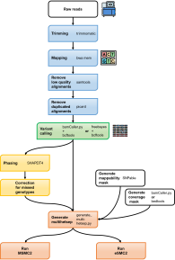

This is the Logfile for the Master's Thesis by Laura Pettrich 

Topic: Genome-wide inference of population history in eukaryotes	

Duration: 03.01.2022 - 03.07.2022			       

Includes all important bioinformatic steps of my thesis.

# Tools

# 1. GENOMES

PKOL = *Panagrolaimus kolymaensis*

JU765 = *Propanagrolaimus* sp. JU765

CRIP = *Chironomus riparius*

## 1.1 *Chironomus riparius*

### BUSCO

    # Download BUSCO for offline usage
    wget -q -O diptera_odb10.gz "https://busco-data.ezlab.org/v4/data/lineages/diptera_odb10.2020-08-05.tar.gz" \
           && tar xf diptera_odb10.gz 

    singularity exec -B /scratch/lpettric/blobtools/CRIP/:/busco_wd/ -B /scratch/lpettric/busco_downloads/:/busco/ /scratch/lpettric/singularity/busco_v5.3.2_cv1.sif busco -m genome -i /busco_wd/Chironomus_riparius_genome_010921.fasta -o /busco_wd/CRIP/Chironomus_riparius_genome_010921.busco.diptera_odb10.tsv -l diptera_odb10 -f --offline --download_path /busco/

### Blastx

    # Cheops 1
    module purge
    module load miniconda/py38_4.9.2

    eval "$(conda shell.bash hook)"

    conda activate /scratch/lpettric/conda/blastx_env/

    blastn -db /scratch/lpettric/nt/nt \
           -query /projects/ag-waldvogel/genomes/CRIP/crip4.0/Chironomus_riparius_genome_010921.fasta \
           -outfmt "6 qseqid staxids bitscore std" \
           -max_target_seqs 10 \
           -max_hsps 1 \
           -evalue 1e-25 \
           -num_threads 32 \
           -out /scratch/lpettric/blobtools/CRIP/Chironomus_riparius_genome_010921.ncbi.blastn.run.out

### Blobtools

    # taxid
    --taxid 315576

    # create dataset
    singularity exec -B /scratch/lpettric/blobtools/CRIP/:/schluppsi -B /scratch/lpettric/blobtools/CRIP/output/:/outolino -B /scratch/lpettric/taxdump/:/taxdumpi /opt/rrzk/software/singularity_images/blobtoolkit_latest.sif blobtools create \
        --fasta /schluppsi/Chironomus_riparius_genome_010921.fasta \
        --meta /schluppsi/Chironomus_riparius_genome_010921.yaml \
        --hits /schluppsi/Chironomus_riparius_genome_010921.ncbi.blastn.run.out \
        --busco /schluppsi/Chironomus_riparius_genome_010921.busco.diptera_odb10.tsv/run_diptera_odb10/full_table.tsv \
        --taxid 315576 \
        --taxdump /taxdumpi \
        --taxrule bestsumorder \
        --cov /schluppsi/MF1.bwamem.sort.q30.rmd.bam \
        /outolino/

    # metadata
    nano Chironomus_riparius_genome_010921.yaml

    assembly:
      alias: Chironomus_riparius_genome_010921
      record_type: chromosome
    taxon:
      name: Chironomus riparius

    # View blobplot
    singularity exec -B /scratch/lpettric/blobtools/CRIP/:/schluppsi -B /scratch/lpettric/blobtools/CRIP/output/output-view:/outolino /opt/rrzk/software/singularity_images/blobtoolkit_latest.sif blobtools view --remote --out /outolino/output --view blob /schluppsi/output

## 1.2 *Panagrolaimus kolymaensis*

### BUSCO

    singularity pull docker://ezlabgva/busco:v5.3.2_cv1

    #Download BUSCO for offline usage
    wget -q -O nematoda_odb10.gz "https://busco-data.ezlab.org/v4/data/lineages/nematoda_odb10.2020-08-05.tar.gz" \
           && tar xf nematoda_odb10.gz 
           
    singularity exec -B /scratch/lpettric/blobtools/:/busco_wd/ -B /scratch/lpettric/busco_downloads/:/busco/ /scratch/lpettric/singularity/busco_v5.3.2_cv1.sif busco -m genome -i /busco_wd/HLNpanKol1.fa -o /busco_wd/HLNpanKol1.busco.nematoda_odb10.tsv -l nematoda_odb10 -f --offline --download_path /busco/

### Blastx

    # Cheops 1
    module purge
    module load miniconda/py38_4.9.2

    eval "$(conda shell.bash hook)"

    conda activate /scratch/lpettric/conda/blastx_env/

    blastn -db /scratch/lpettric/nt/nt \
           -query /projects/ag-waldvogel/genomes/PKOL/HLNpanKol1.fa \
           -outfmt "6 qseqid staxids bitscore std" \
           -max_target_seqs 10 \
           -max_hsps 1 \
           -evalue 1e-25 \
           -num_threads 32 \
           -out /scratch/lpettric/blobtools/HLNpanKol1.ncbi.blastn.run2.out
           

### Blobtools

    singularity exec -B /scratch/lpettric/blobtools/:/schluppsi -B /scratch/lpettric/blobtools/output/:/outolino -B /scratch/lpettric/taxdump/:/taxdumpi /opt/rrzk/software/singularity_images/blobtoolkit_latest.sif blobtools create \
       --fasta /schluppsi/HLNpanKol1.fa \
       --meta /schluppsi/HLNpanKol1.yaml \
       --taxid 2726203 \
       --taxdump /taxdumpi \
       --cov /schluppsi/PKOL1.bwamem.sort.q30.rmd.bam \
        /outolino/

    singularity exec -B /scratch/lpettric/blobtools/:/schluppsi -B /scratch/lpettric/blobtools/output/output-view:/outolino /opt/rrzk/software/singularity_images/blobtoolkit_latest.sif blobtools view --remote --out /outolino/output --view blob /schluppsi/output

Fetch Databases:

Fetch the NCBI Taxdump

    mkdir -p taxdump; cd taxdump; curl -L ftp://ftp.ncbi.nih.gov/pub/taxonomy/new_taxdump/new_taxdump.tar.gz | tar xzf -; cd ..;

Fetch the nt database

    mkdir -p nt wget
    "<ftp://ftp.ncbi.nlm.nih.gov/blast/db/nt>.??.tar.gz" -P nt/ &&\
    for file in nt/\*.tar.gz;\
    do tar xf \$file -C nt && rm \$file;\
    done

Fetch any BUSCO lineages that you plan to use

    mkdir -p busco
    wget -q -O eukaryota_odb10.gz "https://busco-data.ezlab.org/v5/data/lineages/eukaryota_odb10.2020-09-10.tar.gz" \
            && tar xf eukaryota_odb10.gz -C busco
    wget -q -O nematoda_odb10.gz "https://busco-data.ezlab.org/v5/data/lineages/nematoda_odb10.2020-08-05.tar.gz" \
           && tar xf nematoda_odb10.gz -C busco
    wget -q -O metazoa_odb10.gz "https://busco-data.ezlab.org/v5/data/lineages/metazoa_odb10.2021-02-24.tar.gz" \
            && tar xf metazoa_odb10.gz -C busco

Add BUSCO and BLAST to BLOBTOOLS

    singularity exec -B /scratch/lpettric/blobtools/:/schluppsi -B /scratch/lpettric/blobtools/output/:/outolino -B /scratch/lpettric/taxdump/:/taxi /opt/rrzk/software/singularity_images/blobtoolkit_latest.sif     blobtools add \
    --hits /schluppsi/HLNpanKol1.ncbi.blastn.out \
    --busco /schluppsi/HLNpanKol1.busco.nematoda_odb10.tsv/run_nematoda_odb10/full_table.tsv \
    --taxdump /taxi/ \
    /outolino/

Replace BLAST hits

    singularity exec -B /scratch/lpettric/blobtools/PKOL/:/schluppsi -B /scratch/lpettric/blobtools/PKOL/output/:/outolino -B /scratch/lpettric/taxdump/:/taxi /opt/rrzk/software/singularity_images/blobtoolkit_latest.sif blobtools add \
        --hits /schluppsi/HLNpanKol1.ncbi.blastn.run2.out \
        --taxdump /taxi/ \
        --taxrule bestsumorder \
       --replace \
       /outolino/

View blobplot

    singularity exec -B /scratch/lpettric/blobtools/PKOL/:/schluppsi -B /scratch/lpettric/blobtools/PKOL/output/output-view:/outolino /opt/rrzk/software/singularity_images/blobtoolkit_latest.sif blobtools view --remote --out /outolino/output --view blob /schluppsi/output

## 1.3 *Propanagrolaimus* JU765

### BUSCO

    singularity exec -B /scratch/lpettric/blobtools/JU765/:/busco_wd/ -B /scratch/lpettric/busco_downloads/:/busco/ /scratch/lpettric/singularity/busco_v5.3.2_cv1.sif busco -m genome -i /busco_wd/propanagrolaimus_ju765.PRJEB32708.WBPS16.genomic.fa -o /busco_wd/propanagrolaimus_ju765.PRJEB32708.WBPS16.busco.nematoda_odb10.tsv -l nematoda_odb10 -f --offline --download_path /busco/

### Blastx

    # Cheops 1
    module purge
    module load miniconda/py38_4.9.2

    eval "$(conda shell.bash hook)"

    conda activate /scratch/lpettric/conda/blastx_env/

    blastn -db /scratch/lpettric/nt/nt \
           -query /scratch/lpettric/blobtools/JU765/propanagrolaimus_ju765.PRJEB32708.WBPS16.genomic.fa \
           -outfmt "6 qseqid staxids bitscore std" \
           -max_target_seqs 10 \
           -max_hsps 1 \
           -evalue 1e-25 \
           -num_threads 32 \
           -out /scratch/lpettric/blobtools/JU765/propanagrolaimus_ju765.PRJEB32708.WBPS16.ncbi.blastn.run.out
           

### Blobtoolskit

    # taxid
    --taxid 591449

    # create dataset
    singularity exec -B /scratch/lpettric/blobtools/JU765/:/schluppsi -B /scratch/lpettric/blobtools/JU765/output/:/outolino -B /scratch/lpettric/taxdump/:/taxdumpi /opt/rrzk/software/singularity_images/blobtoolkit_latest.sif blobtools create \
        --fasta /schluppsi/propanagrolaimus_ju765.PRJEB32708.WBPS16.genomic.fa \
        --meta /schluppsi/propanagrolaimus_ju765.PRJEB32708.WBPS16.yaml \
        --hits /schluppsi/propanagrolaimus_ju765.PRJEB32708.WBPS16.ncbi.blastn.run.out \
        --busco /schluppsi/propanagrolaimus_ju765.PRJEB32708.WBPS16.busco.nematoda_odb10.tsv/run_nematoda_odb10/full_table.tsv \
        --taxid 591449 \
        --taxdump /taxdumpi \
        --taxrule bestsumorder \
        --cov /schluppsi/JU765_refpool_merged.rmd.q30.sort.bam \
        /outolino/

    # Metadata
    nano propanagrolaimus_ju765.PRJEB32708.WBPS16.yaml

    assembly:
      alias: propanagrolaimus_ju765.PRJEB32708.WBPS16.genomic
      record_type: scaffold
    taxon:
      name: Propanagrolaimus ju765

    # View blobplot
    singularity exec -B /scratch/lpettric/blobtools/JU765/:/schluppsi -B /scratch/lpettric/blobtools/JU765/output/output-view:/outolino /opt/rrzk/software/singularity_images/blobtoolkit_latest.sif blobtools view --remote --out /outolino/ --view blob /schluppsi/output

    STRG+C to exit

    # to kill
    ps aux | grep lpettric
    ps -u lpettric
    lsof -i |grep LISTEN
    kil <PID>

    # Save plot
    singularity exec -B /scratch/lpettric/blobtools/JU765/:/schluppsi -B /scratch/lpettric/blobtools/JU765/output/output-view:/outolino /opt/rrzk/software/singularity_images/blobtoolkit_latest.sif blobtools view --remote --out /outolino/ --format svg --view blob /schluppsi/output

# 2. WORKFLOW

*General workflow of this study. The obtained raw reads were pre-processed, variant calling followed, including filtering steps with either bamCaller.py and bcftools or freebayes and bcftools. An optional phasing followed. To generate the input-files for both SMC models variant files which were either phased or not and additional mappability masks and coverage masks were necessary. This workflow has been designed using resources from Flaticon.com.*

# 3 CRIP READS

## 3.1 First check with fastqc and multiqc

FastQC

    module purge
    module load openjdk/1.8.0_202

     cd /projects/ag-waldvogel/pophistory/CRIP/

    /home/lpettric/bin/FastQC/fastqc --threads 10 -o ./MF1/ ./MF1/MF1_R1.paired.fastq_true.gz ./MF1/MF1_R2.paired.fastq_true.gz &
    wait
    ...

MultiQC

    module purge
    module load miniconda/py38_4.9.2
    eval "$(conda shell.bash hook)"
    conda activate /scratch/lpettric/conda/multiqc_env/

    cd /projects/ag-waldvogel/pophistory/CRIP/

    multiqc --filename multiqc_report_all_trimmed.html -o /projects/ag-waldvogel/pophistory/CRIP/ --file-list /projects/ag-waldvogel/pophistory/CRIP/multiqc-file.list

## 3.2 Mapping with bwa mem

    module purge

    cd /projects/ag-waldvogel/pophistory/CRIP/

    /home/lpettric/bin/bwa/bwa mem -t 20 -M -R '@RG\tID:MF\tSM:MF1\tPL:ILLUMINA' /projects/ag-waldvogel/genomes/CRIP/crip4.0/Chironomus_riparius_genome_010921.fasta ./MF1/MF1_R1.paired.fastq_true.gz ./MF1/MF1_R2.paired.fastq_true.gz > ./bam-files/MF1_bwamem.sam &
    wait
    ...

## 3.3 Sort bam files

    module purge
    module load samtools

    cd /projects/ag-waldvogel/pophistory/CRIP/bam-files

    ls -1 *_bwamem.sam | sed 's/_bwamem.sam//g' > list-crip
    while read f; do samtools view -b $f"_bwamem.sam" > $f".bam" ;done < list-crip
    cat list-crip | /home/lpettric/bin/parallel/bin/parallel -j 20 'samtools sort -@ 4 -o {}.bwamem.sort.bam {}.bam'

"list-crip" contains names of files without file-extension

## 3.4 Collect flagstat statistics

    module purge
    module load samtools

    cd /projects/ag-waldvogel/pophistory/CRIP/bam-files

    /home/lpettric/bin/parallel/bin/parallel -j 20 'samtools flagstat {}.bwamem.sort.bam > {}.bwamem.sort.flagstat' < list-crip

## 3.5 Remove low qulaity alignments

    module purge
    module load samtools

    cd /projects/ag-waldvogel/pophistory/CRIP/bam-files

    /home/lpettric/bin/parallel/bin/parallel -j 20 'samtools view -q 30 -f 0x0002 -F 0x0004 -F 0x0008 -b -o {}.bwamem.sort.q30.bam {}.bwamem.sort.bam' < list-crip

## 3.6 Remove duplicates

    module purge
    module load miniconda/py38_4.9.2
    eval "$(conda shell.bash hook)"
    conda activate /scratch/lpettric/conda/picard_env

    cd /projects/ag-waldvogel/pophistory/CRIP/bam-files/

    picard MarkDuplicates -I MF1.bwamem.sort.q30.bam -O MF1.bwamem.sort.q30.rmd.bam -M MF1.bwamem.sort.q30.rmd.stat -VALIDATION_STRINGENCY SILENT -REMOVE_DUPLICATES true &
    wait
    ...

## 3.7 Collect Mapping statistics

    module purge
    module load miniconda/py38_4.9.2
    eval "$(conda shell.bash hook)"
    conda activate /scratch/lpettric/conda/qualimap_env

    cd /projects/ag-waldvogel/pophistory/CRIP/bam-files/

    qualimap multi-bamqc -d ./list-qualimap -r --java-mem-size=4G -outformat PDF:HTML -outdir ./qualimap-output

# 4 PKOL READS

## 4.1 Trimming of reads

    module purge
    module load trimmomatic/0.39

    cd /projects/ag-waldvogel/pophistory/PKOL/novogene-rawdata/X204SC22020274-Z01-F001/raw_data/PKOL/

    java -jar $TRIMMOMATIC/trimmomatic.jar PE -phred33  \
        -trimlog sample.trimlog PKOL_EDSW220002352-1a_H25W7DSX3_L1_1.fq.gz PKOL_EDSW220002352-1a_H25W7DSX3_L1_2.fq.gz \
        ../../../../trimmed-reads/PKOL1_1.paired.fastq ../../../../trimmed-reads/PKOL1_1.unpaired.fastq ../../../../trimmed-reads/PKOL1_2.paired.fastq ../../../../trimmed-reads/PKOL1_2.unpaired.fastq \
        ILLUMINACLIP:/projects/ag-waldvogel/pophistory/PKOL/Illumina-adapters-2017-modifiedLP.txt:2:30:10:8:true LEADING:3 TRAILING:3 SLIDINGWINDOW:4:20 MINLEN:50 TOPHRED33

## 4.2 First check with fastqc and multiqc

FastQC and MultiQC as described above

## 4.3 Mapping with bwa mem

    module purge

    cd /projects/ag-waldvogel/pophistory/PKOL/

    /home/lpettric/bin/bwa/bwa mem -t 20 -M -R '@RG\tID:PKOL\tSM:PKOL1\tPL:ILLUMINA' /projects/ag-waldvogel/genomes/PKOL/HLNpanKol1.fa ./trimmed-reads/PKOL1_1.paired.fastq ./trimmed-reads/PKOL1_2.paired.fastq > ./bam-files/PKOL1_bwamem.sam 

## 4.5 Sort bam files

    module purge
    module load samtools/1.13

    cd /projects/ag-waldvogel/pophistory/PKOL/bam-files

    samtools view -b PKOL1_bwamem.sam > PKOL1_bwamem.bam &
    wait
    samtools sort -@ 4 -o PKOL1.bwamem.sort.bam PKOL1_bwamem.bam

## 4.6 Collect flagstat statistics

    module purge
    module load samtools/1.13

    cd /projects/ag-waldvogel/pophistory/PKOL/bam-files

    samtools flagstat PKOL1.bwamem.sort.bam > PKOL1.bwamem.sort.flagstat

## 4.7 Remove low qulaity alignments

    module purge
    module load samtools/1.13

    cd /projects/ag-waldvogel/pophistory/PKOL/bam-files

    samtools view -q 30 -f 0x0002 -F 0x0004 -F 0x0008 -b -o PKOL1.bwamem.sort.q30.bam PKOL1.bwamem.sort.bam

## 4.8 Remove duplicates

    module purge
    module load miniconda/py38_4.9.2
    eval "$(conda shell.bash hook)"
    conda activate /scratch/lpettric/conda/picard_env

    cd /projects/ag-waldvogel/pophistory/PKOL/bam-files/

    picard MarkDuplicates -I PKOL1.bwamem.sort.q30.bam -O PKOL1.bwamem.sort.q30.rmd.bam -M PKOL1.bwamem.sort.q30.rmd.stat -VALIDATION_STRINGENCY SILENT -REMOVE_DUPLICATES true 

## 4.9 Collect Mapping statistics

Qualimap was used as described above

# 5 JU765 READS

Already processed reads from Laura Villegas -\> no further steps needed

Qualimap was obtained like described above.

# 6 CRIP MSMC2

Voraussetzung: phased haplotype data of single chromosomes as input

## 6.2 Parts of genome to be analysed

### Get names of chromosomes

    grep '^>' Chironomus_riparius_genome_010921.fasta | sed 's/>//' > chromosome-nr.txt

I will only use the chromosomes not the scaffolds

### Index bam-files

    while read f; do samtools index $f".bwamem.sort.q30.rmd.bam" > $f".bwamem.sort.q30.rmd.bam.bai" ; done < list-crip

### Extract chromosome information + index

a)  Extract chromosome

    samtools faidx Chironomus_riparius_genome_010921.fasta Chr1 > Chr1_Chironomus_riparius_genome_010921.fasta 
    samtools faidx Chironomus_riparius_genome_010921.fasta Chr2 > Chr2_Chironomus_riparius_genome_010921.fasta 
    samtools faidx Chironomus_riparius_genome_010921.fasta Chr3 > Chr3_Chironomus_riparius_genome_010921.fasta 
    samtools faidx Chironomus_riparius_genome_010921.fasta Chr4 > Chr4_Chironomus_riparius_genome_010921.fasta

b)  Index

    /home/lpettric/bin/bwa/bwa index Chr1_Chironomus_riparius_genome_010921.fasta
    /home/lpettric/bin/bwa/bwa index Chr2_Chironomus_riparius_genome_010921.fasta
    /home/lpettric/bin/bwa/bwa index Chr3_Chironomus_riparius_genome_010921.fasta
    /home/lpettric/bin/bwa/bwa index Chr4_Chironomus_riparius_genome_010921.fasta

## 6.2 Create mappability mask per chromosome using SNPable

a)  Extract overlapping 145mers subsequences as artificial reads from
    Chr1

I have the same data as Ann-Marie so I choose the same length

    /home/lpettric/bin/seqbility-20091110/splitfa Chr1_Chironomus_riparius_genome_010921.fasta 145 | split -l 20000000
    /home/lpettric/bin/seqbility-20091110/splitfa Chr2_Chironomus_riparius_genome_010921.fasta 145 | split -l 20000000
    /home/lpettric/bin/seqbility-20091110/splitfa Chr3_Chironomus_riparius_genome_010921.fasta 145 | split -l 20000000
    /home/lpettric/bin/seqbility-20091110/splitfa Chr4_Chironomus_riparius_genome_010921.fasta 145 | split -l 20000000

    cat xaa xab xac xad xae xaf xag > Chr1_145splits.fa
    cat xaa xab xac xad xae xaf > Chr2_145splits.fa
    cat xaa xab xac xad xae xaf > Chr3_145splits.fa
    cat xaa xab > Chr4_145splits.fa

b)  Map artificial reads back to chromosomes

    /home/lpettric/bin/bwa/bwa aln -R 1000000 -O 3 -E 3 Chr1/Chr1_Chironomus_riparius_genome_010921.fasta Chr1/145mer-subsequences/Chr1_145splits.fa > Chr1/145mer-subsequences/Chr1_145splits_bwaaln.sai

c)  Convert sai to sam

    /home/lpettric/bin/bwa/bwa samse Chr1/Chr1_Chironomus_riparius_genome_010921.fasta Chr1/145mer-subsequences/Chr1_145splits_bwaaln.sai Chr1/145mer-subsequences/Chr1_145splits.fa > Chr1_145splits_bwaaln.sam

    gzip Chr1_145splits_bwaaln.sam

d)  Generate rawMask

    gzip -dc Chr1_145splits_bwaaln.sam.gz | /home/lpettric/bin/seqbility-20091110/gen_raw_mask.pl > rawMask_Chr1_145.fa

e)  Generate the final mask

    gen_mask -l 145 -r 0.5 rawMask_Chr1_145.fa > mask_Chr1_145_50.fa

**length 145bp** **stringency 0.5**

f)  convert final-masks to .bed using makeMappabilitMask.py change paths
    of input and output

## 6.3 Variant calling and phasing

a)  Try script from msmc-tools (bamCaller.py)

Get coverage statistics per chromosome

    while read f; do samtools depth -r Chr1 $f".bwamem.sort.q30.rmd.bam" | awk '{sum += $3} END {print sum / NR}' > $f".Chr1.cov" ; done < list-crip

repeat for every chromosome

run bamCaller.py

    samtools mpileup -q 30 -Q 20 -C 50 -u -r <chr> -f <ref.fa> <bam> | bcftools call -c -V indels | /home/lpettric/bin/msmc-tools/bamCaller.py <mean_cov> <out_mask.bed.gz> | gzip -c > <out.vcf.gz>

    # samtools:
    # q = Minimum mapping quality for an alignment to be used
    # Q = Minimum base quality for a base to be considered.
    # C = Coefficient for downgrading mapping quality for reads containing excessive mismatches. Given a read with a phred-scaled probability q of being generated from the mapped position, the new mapping quality is about sqrt((INT-q)/INT)*INT. A zero value disables this functionality; if enabled, the recommended value for BWA is 50. 
    # u = uncompressed
    # r = Only generate pileup in region. Requires the BAM files to be indexed. If used in conjunction with -l then considers the intersection of the two requests.
    # f = fasta-ref
    # bcftools:
    # c = consensus-caller
    # V = skip-variants snps|indels

Get summary list of coverage per chromosome per bam

    awk '{print $0 "\t" FILENAME}' *.Chr1.cov > Chr1.summary

Final command: Instead of samtools use bcftools because mpielup migrated
to it

    module purge
    module load samtools/1.13
    module load python/3.4.3

    cd /projects/ag-waldvogel/pophistory/CRIP/bam-files

    # Chr1
    while read -r x y; do bcftools mpileup -q 30 -Q 20 -C 50 -r Chr1 -f /projects/ag-waldvogel/genomes/CRIP/crip4.0/Chironomus_riparius_genome_010921.fasta $y".bwamem.sort.q30.rmd.bam" | bcftools call -c -V indels | /home/lpettric/bin/msmc-tools/bamCaller.py $x $y"_mask.bed.gz" | gzip -c > $y".vcf.gz" ;done < ./mean-coverage-chromosome/Chr1.summary

--\> changed script, so that it is directly bgzipped

    # Chr2
    while read -r x y; do bcftools mpileup -q 30 -Q 20 -C 50 -r Chr2 -f /projects/ag-waldvogel/genomes/CRIP/crip4.0/Chironomus_riparius_genome_010921.fasta $y".bwamem.sort.q30.rmd.bam" | bcftools call -c -V indels | /home/lpettric/bin/msmc-tools/bamCaller.py $x $y"_Chr2_mask.bed.gz" | bgzip -c > $y"_Chr2.vcf.gz" ;done < ./mean-coverage-chromosome/Chr2.summary

merge vcf.files and zip and index them (because no reference panel)

    bgzip *.vcf --> bcftools only index if they are bgzipped

normal gzip wrong! need to change to bgzip

command for already existing files of Chr1:

    for f in *vcf*; do zcat $f | bgzip -c > $f".bgz" ; done

check type of vcf with:

    htsfile file.vcf.gz

index

    for f in *vcf.gz; do bcftools index $f; done

you get csi index

    bcftools merge --print-header *.vcf.gz    # to get header info to see if there are recurring headers
    bcftools merge -O z -o merged_Chr1.vcf.gz  *.vcf.gz       

b)  No reference panel, that's why we merged the vcf, now we filter to
    only have monoallelic and biallelic SNPs

    bcftools view -M 2 -O z -o merged_biallelic_Chr1.vcf.gz
    merged_Chr1.vcf.gz bcftools index merged_biallelic_Chr1.vcf.gz

c)  Phasing with SHAPEIT

Shapeit4.2 was modified by Peter Heger to remove AVX2 dependency

start shapeit main run (need to load boost and samtools)

    /home/lpettric/bin/shapeit4/bin/shapeit4.2 -I merged_biallelic_Chr1.vcf.gz -O ./phased/merged_biallelic_Chr1_phased.vcf.gz --sequencing --region Chr1 --log  /phased/shapeit_Chr1.log

after phasing all individuals together, seperate them again

    while read f; do bcftools view -s $f -O z -o $f"_Chr1_phased.vcf.gz" merged_biallelic_Chr1_phased.vcf.gz ; done < ../../../bam-files/list-crip

vcf.gz files indexed

    for f in *.vcf.gz; do bcftools index $f; done

e)  Correct for missed genotypes

These files now contain the pashed alleles for each individual. However,
the pre-phased files might contain more information that should not be
lost.

merging phased and unphased vcfs, keeping all unphased sites from the
original vcf, but replacing the phased ones

use --force-samples because phased and unphase have same headers

    while read f; do bcftools merge --force-samples ../$f"_Chr1.vcf.gz" $f"_Chr1_phased.vcf.gz" | awk '
    BEGIN {OFS="\t"}
    $0 ~ /^##/ {print}
    $0 ~ /^#CHROM/ {print $1, $2, $3, $4, $5, $6, $7, $8, $9, $10}
    $0 !~ /^#/ {
    if(substr($11, 1, 3) != "./.")
    $10 = $11
    print $1, $2, $3, $4, $5, $6, $7, $8, $9, $10
    }' | bcftools view -O z > $f"_Chr1_phased_merged.vcf.gz" ; done < ../../../bam-files/list-crip

## 6.4 Create input-files (multihetsep)

    while read a b c d; do /home/lpettric/bin/msmc-tools//generate_multihetsep.py --mask=../$a"_Chr1_mask.bed.gz" \
                          --mask=..$b"_Chr1_mask.bed.gz" \
                          --mask=..$c"_Chr1_mask.bed.gz" \
                          --mask=..$d"_Chr1_mask.bed.gz" \
                          --mask=/projects/ag-waldvogel/pophistory/CRIP/masking/final-mask/mask_Chr1_145_50.bed.gz \
                          $a"_Chr1_phased_merged.vcf.gz" $b"_Chr1_phased_merged.vcf.gz" \
                          $c"_Chr1_phased_merged.vcf.gz" $d"_Chr1_phased_merged.vcf.gz" > "multihetsep_"$a"_"$b"_"$c"_"$d"_Chr1.txt"; done < ../../../msmc2/list-populations

## 6.5 Create input file for cross-coalescence

Create multihetsep with 16 haplotypes

        #Cheops0
        module purge
        module load python/3.4.3
        cd /projects/ag-waldvogel/pophistory/CRIP/phasing/Chr1/phased
        # 4 inidividuals per population
        while read a b c d e f g h; do /home/lpettric/bin/msmc-tools//generate_multihetsep.py --mask=../$a"_Chr1_mask.bed.gz" \
                          --mask=../$b"_Chr1_mask.bed.gz" \
                          --mask=../$c"_Chr1_mask.bed.gz" \
                          --mask=../$d"_Chr1_mask.bed.gz" \
                          --mask=../$e"_Chr1_mask.bed.gz" \
                          --mask=../$f"_Chr1_mask.bed.gz" \
                          --mask=../$g"_Chr1_mask.bed.gz" \
                          --mask=../$h"_Chr1_mask.bed.gz" \
                          --mask=/projects/ag-waldvogel/pophistory/CRIP/masking/final-mask/mask_Chr1_145_50.bed.gz \
                          $a"_Chr1_phased_merged.vcf.gz" $b"_Chr1_phased_merged.vcf.gz" \
                          $c"_Chr1_phased_merged.vcf.gz" \
                          $d"_Chr1_phased_merged.vcf.gz" $e"_Chr1_phased_merged.vcf.gz" $f"_Chr1_phased_merged.vcf.gz" \
                          $g"_Chr1_phased_merged.vcf.gz" \
                          $h"_Chr1_phased_merged.vcf.gz"> /projects/ag-waldvogel/pophistory/CRIP/msmc2/multihetsep-Chr1/"multihetsep_"$a"-"$h"_joined_Chr1.txt"; done < /projects/ag-waldvogel/pophistory/CRIP/msmc2/list-populations-cc

For list-populations-cc see below:

list-populations-cc (Original ohne Nummerierung):

1.  MF1 MF2 MF3 MF4 MG2 MG3 MG4 MG5

2.  MF1 MF2 MF3 MF4 NMF1 NMF2 NMF3 NMF4

3.  MF1 MF2 MF3 MF4 SI1 SI2 SI3 SI4

4.  MF1 MF2 MF3 MF4 SS1 SS2 SS3 SS4

5.  MG2 MG3 MG4 MG5 NMF1 NMF2 NMF3 NMF4

6.  MG2 MG3 MG4 MG5 SI1 SI2 SI3 SI4

7.  MG2 MG3 MG4 MG5 SS1 SS2 SS3 SS4

8.  NMF1 NMF2 NMF3 NMF4 SI1 SI2 SI3 SI4

9.  NMF1 NMF2 NMF3 NMF4 SS1 SS2 SS3 SS4

10. SI1 SI2 SI3 SI4 SS1 SS2 SS3 SS4

## 6.6 Run msmc2 cross-coalescence

### Example with MF1-MG5

    # Create cross-coalesence of populations 
    # Cheops1
    module purge

    cd /projects/ag-waldvogel/pophistory/CRIP/msmc2/cross-coalescene

    # MF (within1) - MG (within2)
    /home/lpettric/bin/msmc2/build/release/msmc2 --skipAmbiguous -p 1*3+1*2+22*1+1*2+1*3 -t 5 -I 0,1,2,3,4,5,6,7 -o ./run2/within1_msmc2_MF1-MG5 ../multihetsep-Chr1/multihetsep_MF1-MG5_joined_Chr1.txt ../multihetsep-Chr2/multihetsep_MF1-MG5_joined_Chr2.txt ../multihetsep-Chr3/multihetsep_MF1-MG5_joined_Chr3.txt ../multihetsep-Chr4/multihetsep_MF1-MG5_joined_Chr4.txt &
    wait
    /home/lpettric/bin/msmc2/build/release/msmc2 --skipAmbiguous -p 1*3+1*2+22*1+1*2+1*3 -t 5 -I 8,9,10,11,12,13,14,15 -o ./run2/within2_msmc2_MF1-MG5 ../multihetsep-Chr1/multihetsep_MF1-MG5_joined_Chr1.txt ../multihetsep-Chr2/multihetsep_MF1-MG5_joined_Chr2.txt ../multihetsep-Chr3/multihetsep_MF1-MG5_joined_Chr3.txt ../multihetsep-Chr4/multihetsep_MF1-MG5_joined_Chr4.txt &
    wait
    /home/lpettric/bin/msmc2/build/release/msmc2 --skipAmbiguous -p 1*3+1*2+22*1+1*2+1*3 -t 5 -I 0-8,0-9,0-10,0-11,0-12,0-13,0-14,0-15,1-8,1-9,1-10,1-11,1-12,1-13,1-14,1-15,2-8,2-9,2-10,2-11,2-12,2-13,2-14,2-15,3-8,3-9,3-10,3-11,3-12,3-13,3-14,3-15,4-8,4-9,4-10,4-11,4-12,4-13,4-14,4-15,5-8,5-9,5-10,5-11,5-12,5-13,5-14,5-15,6-8,6-9,6-10,6-11,6-12,6-13,6-14,6-15,7-8,7-9,7-10,7-11,7-12,7-13,7-14,7-15 -o ./run2/across_msmc2_MF1-MG5 ../multihetsep-Chr1/multihetsep_MF1-MG5_joined_Chr1.txt ../multihetsep-Chr2/multihetsep_MF1-MG5_joined_Chr2.txt ../multihetsep-Chr3/multihetsep_MF1-MG5_joined_Chr3.txt ../multihetsep-Chr4/multihetsep_MF1-MG5_joined_Chr4.txt

### Create combined cross-coalescence

    #Cheops0
    module purge
    module load python/3.4.3
    cd /projects/ag-waldvogel/pophistory/CRIP/msmc2/cross-coalescene/run2
    # MF-MG
    /home/lpettric/bin/msmc-tools/combineCrossCoal.py across_msmc2_MF1-MG5.final.txt within1_msmc2_MF1-MG5.final.txt within2_msmc2_MF1-MG5.final.txt > combinedMF1-MG5_msmc2.final.txt

### Account for uncertainities

a)  Form mean value for estimates of every population

b)  Convert lambda and left-time-boundary to real time data 

         time <- ((data$left_time_boundary+data$right_time_boundary)/2)/mu*gen) # years ago
         time2 <- ((data$left_time_boundary+data$right_time_boundary)/2)/mu) # generations ago
         pop.size <- (1/data$lambda)/(2*mu)

         mu = 4.27*10^-9
         gen = generation time = time/generations = 1 year / 10.1 generations 
         # 10.1 = mean value generations per year from Waldvogel et al. 2018 supplement
         # use genertaion time of every population!!!

         ## IN ANALYSIS USE GENERATION TIME OF EVERY POPULATION seperate! ##

c)  Remove values with unrealistic lambda (jump in value) => first 5 values and last --> remove it constant across populations

d)  Estimate mean haplotype length (MHL) and time to most recent ancestor (tMRCA) per population

    #Cheops0 module purge module load samtools/1.13

    cd
    /projects/ag-waldvogel/pophistory/CRIP/msmc2/callable-sites/snp-call/

    # repeat variant calling without splitting data per chromosome, indels should be included to get correct number of records

    while read y; do bcftools mpileup -q 30 -Q 20 -C 50 -r Chr1,Chr2,Chr3,Chr4 -f /projects/ag-waldvogel/genomes/CRIP/crip4.0/Chironomus_riparius_genome_010921.fasta /projects/ag-waldvogel/pophistory/CRIP/bam-files/$y”.bwamem.sort.q30.rmd.bam” | bcftools call -c | bgzip -c > $y”_allChr_inclIndel.vcf.gz” ;done < /projects/ag-waldvogel/pophistory/CRIP/bam-files/list-crip & 
    wait 
    for f in *_allChr_inclIndel.vcf.gz; do bcftools index $f; done &
    wait 
    while read x; do bcftools view -M 2 -O z -o ./biallelic-snp/$x"_allChr_inclIndel_biallelic.vcf.gz" $x"_allChr_inclIndel.vcf.gz" ;done < /projects/ag-waldvogel/pophistory/CRIP/bam-files/list-crip & 
    wait 
    cd /projects/ag-waldvogel/pophistory/CRIP/msmc2/callable-sites/snp-call/biallelic-snp/ & 
    wait 
    for f in *_allChr_inclIndel_biallelic.vcf.gz; do bcftools index $f; done & 
    wait 
    while read x; do bcftools stats $x"_allChr_inclIndel_biallelic.vcf.gz" >  $x"_allChr_inclIndel_biallelic.vcf.stats" ;done < /projects/ag-waldvogel/pophistory/CRIP/bam-files/list-crip

Biallelic filtering not neccessary =\> total number of SNPs -
multiallelic SNPs = diallelic SNPs

      total SNPs - multiallelic SNPs = diallelic SNPs
      diallelic SNPs/number of records = Heterozygosity
      Mean Heterozygosity*100000 = X heterzygote position per 100000 bases
      100000 bases/X heterzygote position = 1 het per X bases (i.e. einfacher Dreisatz)
      X bases * SER = MHL
      1/(2*r*MHL) = tMRCA

# 7 CRIP eSMC2

## 7.1

### Create multihetsep per individual for each chromosome

    cd /projects/ag-waldvogel/pophistory/CRIP/phasing/

    while read a b; do /home/lpettric/bin/msmc-tools/generate_multihetsep.py --mask=$b/$a"_"$b"_mask.bed.gz" \
                          --mask=/projects/ag-waldvogel/pophistory/CRIP/masking/final-mask/"mask_"$b"_145_50.bed.gz" \
                          $b/phased/$a"_"$b"_phased_merged.vcf.gz" > /projects/ag-waldvogel/pophistory/CRIP/esmc/multihetsep-files/"multihetsep_"$a"_"$b".txt"; done < /projects/ag-waldvogel/pophistory/CRIP/esmc/list-crip-chr
                          

## 7.2 Recombination rate needed

"I used the recombination rates from Schmidt, Hellmann, Waldvogel et al.
(2020). Ann-Marie suplied me with unpublished rates for each population.
These rates were in rho = 1/bp but for the eSMC2 model and the tMRCA
calculations I need it it r = cM/Mb. The formula to get r would be:

r = rho/(2*c*Ne) (Peñalba and Wolf, 2020

[""where c refers to the ploidy of the genome, Ne is the effective
population size and r is the recombina-tion rate in units of meiosis per
generation""]).

I follwed these steps to obtain r:

1.  Change units from 1/bp to 1/Mb

2.  Use fromula r = rho/(2*c*Ne) to get r -\> diploidy: 2, Ne: Oppold
    and Pfenninger 2017, supplement

3.  Relate r to the genetic map length to get cM/Mb -\> genetic map
    length of Drosophila melanogaster: 287.3 cM (Comeron, Ratnappan et
    al. 2012) --\> r\*287.3

4.  Result is r in cM/Mb"

## 7.3 use recombination rate per population and don't define beta and sigma

Population r in cM/Mb

MF 1.207492754

MG 1.368095238

NMF 0.727341772

SI 1.305909091

SS 2.204860465

Mean 1.362739864

R-script:

    ###################
    # Source function #
    ###################
    library(eSMC2)

    setwd("/projects/ag-waldvogel/pophistory/CRIP/esmc")
    ##############
    # Parameters # 
    ##############

    # Please Fill all value

    mu=4.27*10^(-9)   # Mutation rate per position per generation 
    r=1.21*10^(-8)   # recombination rate per position per generation per population
    rho=r/mu # ratio recombination/mutation 
    M=2 # Number of haplotypes

    ###################################
    # Set one to TRUE (rest to FALSE) #
    ###################################
    ER=F # True to estimate recombination rate
    SF=T # True to estimate selfing rate
    SB=F # True to estimate germination rate

    # Set boundaries

    BoxB=c(0.05,1) #  min and max value of germination rate 
    Boxs=c(0,0.99) #  min and max value of selfing rate 

    ############
    # Get data #
    ############

    # example 
    NC=4 # Number of analysed chromosmes
    full_data=list()
    # We build the data of the 4 chromosomes
    path=paste("/projects/ag-waldvogel/pophistory/CRIP/esmc/multihetsep-files") # Put character string of path to the multihetsep file
    for(chromosome in 1:4){
    if(chromosome>=10){
    chromosome_n=as.character(chromosome)
    }else{
      chromosome_n=paste("Chr",as.character(chromosome),sep="")
     }
    filename=paste("multihetsep_","MF1_",chromosome_n,".txt",sep="") # Put character string of the multihetsep file name
    data=Get_real_data(path,M,filename,delim="\t")
    full_data[[chromosome]]=data
    }

    ################
    # Run analysis #
    ################

    resultMF1=eSMC2(n=30,rho=rho,full_data,BoxB=BoxB,Boxs=Boxs,SB=SB,SF=SF,Rho=ER,Check=F,NC=NC) 
    save(resultMF1,file="CRIP-MF1-eSMC-run2.RData")

    ################
    # Plot results #
    ################
    pdf(file="CRIP-MF1-eSMC-run2.pdf")
    Plot_esmc_results(resultMF1,mu,WP=F,LIST=F)
    dev.off()

## 7.4 use mean rec. rate of CRIP

    ###################
    # Source function #
    ###################
    library(eSMC2)

    setwd("/projects/ag-waldvogel/pophistory/CRIP/esmc")
    ##############
    # Parameters # 
    ##############

    # Please Fill all value

    mu=4.27*10^(-9)   # Mutation rate per position per generation 
    r=1.36*10^(-8)   # recombination rate per position per generation of CRIP (mean value)
    rho=r/mu # ratio recombination/mutation 
    M=2 # Number of haplotypes
    sigma=0
    beta=1

    ###################################
    # Set one to TRUE (rest to FALSE) #
    ###################################
    ER=T # True to estimate recombination rate
    SF=F # True to estimate selfing rate
    SB=F # True to estimate germination rate

    # Set boundaries
    Boxr=c(1,1) # min and max value for recombination rate
    BoxB=c(0.05,1) #  min and max value of germination rate 
    Boxs=c(0,0.99) #  min and max value of selfing rate 

    ############
    # Get data #
    ############

    # example 
    NC=4 # Number of analysed chromosmes
    full_data=list()
    # We build the data of the 4 chromosomes
    path=paste("/projects/ag-waldvogel/pophistory/CRIP/esmc/multihetsep-files") # Put character string of path to the multihetsep file
    for(chromosome in 1:4){
    if(chromosome>=10){
      chromosome_n=as.character(chromosome)
    }else{
      chromosome_n=paste("Chr",as.character(chromosome),sep="")
    }
    filename=paste("multihetsep_","MF1_",chromosome_n,".txt",sep="") # Put character string of the multihetsep file name
    data=Get_real_data(path,M,filename,delim="\t")
    full_data[[chromosome]]=data

}

    ################
    # Run analysis #
    ################

    resultMF1=eSMC2(n=30,rho=rho,full_data,BoxB=BoxB,Boxs=Boxs,Boxr=Boxr,SB=SB,SF=SF,Rho=ER,Check=F,NC=NC) 
    save(resultMF1,file="CRIP-MF1-eSMC-run4.RData")

    ################
    # Plot results #
    ################
    pdf(file="CRIP-MF1-eSMC-run4.pdf")
    Plot_esmc_results(resultMF1,mu,WP=F,LIST=F)
    dev.off()

## 7.5 use rec. rate of Drosophila melanogaster

    ###################
    # Source function #
    ###################
    library(eSMC2)

    setwd("/projects/ag-waldvogel/pophistory/CRIP/esmc")
    ##############
    # Parameters # 
    ##############

    # Please Fill all value

    mu=4.27*10^(-9)   # Mutation rate per position per generation 
    r=2.1*10^(-8)   # recombination rate per position per generation of Drosophila (paper Ann-Marie)
    rho=r/mu # ratio recombination/mutation 
    M=2 # Number of haplotypes
    sigma=0
    beta=1

    ###################################
    # Set one to TRUE (rest to FALSE) #
    ###################################
    ER=T # True to estimate recombination rate
    SF=F # True to estimate selfing rate
    SB=F # True to estimate germination rate

    # Set boundaries
    Boxr=c(1,1) # min and max value for recombination rate
    BoxB=c(0.05,1) #  min and max value of germination rate 
    Boxs=c(0,0.99) #  min and max value of selfing rate 

    ############
    # Get data #
    ############

    # example 
    NC=4 # Number of analysed chromosmes
    full_data=list()
    # We build the data of the 4 chromosomes
    path=paste("/projects/ag-waldvogel/pophistory/CRIP/esmc/multihetsep-files") # Put character string of path to the multihetsep file
    for(chromosome in 1:4){
    if(chromosome>=10){
      chromosome_n=as.character(chromosome)
    }else{
      chromosome_n=paste("Chr",as.character(chromosome),sep="")
    }
    filename=paste("multihetsep_","MF1_",chromosome_n,".txt",sep="") # Put character string of the multihetsep file name
    data=Get_real_data(path,M,filename,delim="\t")
    full_data[[chromosome]]=data
    }

    ################
    # Run analysis #
    ################

    resultMF1=eSMC2(n=30,rho=rho,full_data,BoxB=BoxB,Boxs=Boxs,Boxr=Boxr,SB=SB,SF=SF,Rho=ER,Check=F,NC=NC) 
    save(resultMF1,file="CRIP-MF1-eSMC-run5.RData")

    ################
    # Plot results #
    ################
    pdf(file="CRIP-MF1-eSMC-run5.pdf")
    Plot_esmc_results(resultMF1,mu,WP=F,LIST=F)
    dev.off()

## 7.6 use recombination rate per population

    ###################
    # Source function #
    ###################
    library(eSMC2)

    setwd("/projects/ag-waldvogel/pophistory/CRIP/esmc")
    ##############
    # Parameters # 
    ##############

    # Please Fill all value

    mu=4.27*10^(-9)   # Mutation rate per position per generation 
    r=1.21*10^(-8)   # recombination rate per position per generation of Drosophila (from rec. rate calculator)
    rho=r/mu # ratio recombination/mutation 
    M=2 # Number of haplotypes
    sigma=0
    beta=1

    ###################################
    # Set one to TRUE (rest to FALSE) #
    ###################################
    ER=T # True to estimate recombination rate
    SF=F # True to estimate selfing rate
    SB=F # True to estimate germination rate

    # Set boundaries

    Boxr=c(1,1) # min and max value for recombination rate
    BoxB=c(0.05,1) #  min and max value of germination rate 
    Boxs=c(0,0.99) #  min and max value of selfing rate 

    ############
    # Get data #
    ############

    # example 
    NC=4 # Number of analysed chromosmes
    full_data=list()
    # We build the data of the 4 chromosomes
    path=paste("/projects/ag-waldvogel/pophistory/CRIP/esmc/multihetsep-files") # Put character string of path to the multihetsep file
    for(chromosome in 1:4){
      if(chromosome>=10){
        chromosome_n=as.character(chromosome)
      }else{
        chromosome_n=paste("Chr",as.character(chromosome),sep="")
      }
      filename=paste("multihetsep_","MF1_",chromosome_n,".txt",sep="") # Put character string of the multihetsep file name
      data=Get_real_data(path,M,filename,delim="\t")
      full_data[[chromosome]]=data
    }

    ################
    # Run analysis #
    ################

    resultMF1=eSMC2(n=30,rho=rho,full_data,BoxB=BoxB,Boxs=Boxs,Boxr=Boxr,SB=SB,SF=SF,Rho=ER,Check=F,NC=NC)  
    save(resultMF1,file="CRIP-MF1-eSMC-run6.RData")

    ################
    # Plot results #
    ################
    pdf(file="CRIP-MF1-eSMC-run6.pdf")
    Plot_esmc_results(resultMF1,mu,WP=F,LIST=F)
    dev.off()

# 8 PKOL eSMC2 - 8 contigs

## 8.1 Parts of genome to be analysed

### Index bam-file

     samtools index PKOL1.bwamem.sort.q30.rmd.bam > PKOL1.bwamem.sort.q30.rmd.bam.bai

### Extract contigs information + index

a)  Extract contigs

         # haplotype1

         samtools faidx HLNpanKol1.fa tig00000955 > tig00000955_HLNpanKol1.fa
         samtools faidx HLNpanKol1.fa tig00001010 > tig00001010_HLNpanKol1.fa
         samtools faidx HLNpanKol1.fa tig00000497 > tig00000497_HLNpanKol1.fa
         samtools faidx HLNpanKol1.fa tig00001214 > tig00001214_HLNpanKol1.fa

         # haplotype2

         samtools faidx HLNpanKol1.fa tig00000909 > tig00000909_HLNpanKol1.fa
         samtools faidx HLNpanKol1.fa tig00001035 > tig00001035_HLNpanKol1.fa

         # haplotype3

         samtools faidx HLNpanKol1.fa tig00001042 > tig00001042_HLNpanKol1.fa
         samtools faidx HLNpanKol1.fa tig00000247 > tig00000247_HLNpanKol1.fa

b)  Index

          for f in *.fa; do /home/lpettric/bin/bwa/bwa index $f; done

## 8.2 Create mappability mask per chromosome using SNPable

a)  Extract overlapping 150mers subsequences as artificial reads from
    contigs I chose maximum read length = 150

         /home/lpettric/bin/seqbility-20091110/splitfa tig00000955_HLNpanKol1.fa 150 | split -l 20000000
         /home/lpettric/bin/seqbility-20091110/splitfa tig00001010_HLNpanKol1.fa 150 | split -l 20000000
         /home/lpettric/bin/seqbility-20091110/splitfa tig00000497_HLNpanKol1.fa 150 | split -l 20000000
         /home/lpettric/bin/seqbility-20091110/splitfa tig00001214_HLNpanKol1.fa 150 | split -l 20000000

         /home/lpettric/bin/seqbility-20091110/splitfa tig00000909_HLNpanKol1.fa 150 | split -l 20000000
         /home/lpettric/bin/seqbility-20091110/splitfa tig00001035_HLNpanKol1.fa 150 | split -l 20000000

         /home/lpettric/bin/seqbility-20091110/splitfa tig00001042_HLNpanKol1.fa 150 | split -l 20000000
         /home/lpettric/bin/seqbility-20091110/splitfa tig00000247_HLNpanKol1.fa 150 | split -l 20000000

merge xa? files to one file and

        cat xa* > tig00000955_150splits.fa
        cat xa* > tig00001010_150splits.fa
        cat xa* > tig00000497_150splits.fa
        cat xa* > tig00001214_150splits.fa

        cat xa* > tig00000909_150splits.fa
        cat xa* > tig00001035_150splits.fa

        cat xa* > tig00001042_150splits.fa
        cat xa* > tig00000247_150splits.fa

b)  Map artificial reads back to contigs

         while read e f; do /home/lpettric/bin/bwa/bwa aln -R 1000000 -O 3 -E 3 $e/$f/$f"_HLNpanKol1.fa" $e/$f/$f"_150splits.fa" > $e/$f/$f"_150splits_bwaaln.sai"; done < list-contigs

c)  Convert sai to sam

         while read e f; do /home/lpettric/bin/bwa/bwa samse $e/$f/$f"_HLNpanKol1.fa" $e/$f/$f"_150splits_bwaaln.sai" $e/$f/$f"_150splits.fa" > $e/$f/$f"_150splits_bwaaln.sam"; done < list-contigs

         while read e f; do gzip $e/$f/$f"_150splits_bwaaln.sam"; done < list-contigs

d)  Generate rawMask

         while read e f; do gzip -dc $e/$f/$f"_150splits_bwaaln.sam.gz" | /home/lpettric/bin/seqbility-20091110/gen_raw_mask.pl > $e/$f/"rawMask_"$f"_150.fa"; done < list-contigs

e)  Generate the final mask

         while read e f; do /home/lpettric/bin/seqbility-20091110/gen_mask -l 150 -r 0.5  $e/$f/"rawMask_"$f"_150.fa" > final-masks/"mask_"$f"_150_50.fa"; done < list-contigs

**length 150bp** **stringency 0.5**

f)  convert final-masks to .bed using makeMappabilitMask.py change paths
    of input and output

         module load python/2.7.5
         ./makeMappabilitMask.py

## 8.3 Variant calling

Get coverage statistics per chromosome

        while read f; do samtools depth -r $f PKOL1.bwamem.sort.q30.rmd.bam | awk '{sum += $3} END {print sum / NR}' > $f".PKOL1.depth" ; done < list-contig-names

try freebayes

        while read f; do freebayes -f /projects/ag-waldvogel/genomes/PKOL/HLNpanKol1.fa -p 3 -r $f bam-files/PKOL1.bwamem.sort.q30.rmd.bam > vcf-files/freebayes/$f"_PKOL1_freebayes_raw.vcf" ;done < bam-files/list-contig-names

filter freebayes vcf-files (filter to only have triallelic sites)

        while read f; do bcftools view $f"_PKOL1_freebayes_raw.vcf" -i 'QUAL>10 & FORMAT/DP>2' -M 3 -V indels -O z > $f"_PKOL1_freebayes_filtered.vcf.gz" ;done < /projects/ag-waldvogel/pophistory/PKOL/bam-files/list-contig-names    

Index files

        for f in *.vcf.gz; do bcftools index $f; done

How many variants are there?

    bcftools view -H tig00001214_PKOL1_freebayes_filtered.vcf.gz | wc -l

Since I didn't use bamCaller.py, I need to create bed-masks
differently!!!

See pipeline eSMC

        # Cheops1
        module purge
        module load bedtools/2.29.2

        cd /projects/ag-waldvogel/pophistory/PKOL/

        bedtools genomecov -bga -ibam bam-files/PKOL1.bwamem.sort.q30.rmd.bam -g /projects/ag-waldvogel/genomes/PKOL/HLNpanKol1.fa > vcf-files/freebayes/PKOL1.genomecov 

        cat vcf-files/freebayes/PKOL1.genomecov | awk '($4 > 5) && ($4 < 70 )' | bedtools merge -i - | gzip -c > vcf-files/freebayes/PKOL1.individual.mask.bed.gz   

        while read f; do zgrep $f vcf-files/freebayes/PKOL1.individual.mask.bed.gz > vcf-files/freebayes/$f"_PKOL1.individual.mask.bed" ;done < /projects/ag-waldvogel/pophistory/PKOL/bam-files/list-contig-names

        cd /projects/ag-waldvogel/pophistory/PKOL/vcf-files/freebayes

        for f in *_PKOL1.individual.mask.bed*; do gzip $f ;done

## 8.4 Create input-files (multihetsep)

        module purge
        module load python/3.4.3

        cd /projects/ag-waldvogel/pophistory/PKOL/

        while read f; do /home/lpettric/bin/msmc-tools/generate_multihetsep.py --mask=vcf-files/freebayes/$f"_PKOL1.individual.mask.bed.gz" \
                             --mask=masking/final-masks/"mask_"$f"_150_50.bed.gz" \
                             vcf-files/freebayes/$f"_PKOL1_freebayes_filtered_test.vcf.gz" > esmc/"multihetsep_"$f"_PKOL1_freebayes_test.txt"; done < bam-files/list-contig-names

## 8.5 R-script:

    ###################
    # Source function #
    ###################
    library(eSMC2)

    ##############
    # Parameters # 
    ##############

    # Please Fill all value

    mu=(5.97*10^(-10))/3   # Mutation rate per position per generation 
    r=0   # recombination rate per position per generation 
    rho=r/mu # ratio recombination/mutation 
    M=3 # Number of haplotypes

    ###################################
    # Set one to TRUE (rest to FALSE) #
    ###################################
    ER=F # True to estimate recombination rate
    SF=T # True to estimate selfing rate
    SB=F # True to estimate germination rate

    # Set boundaries

    BoxB=c(0.05,1) #  min and max value of germination rate 
    Boxs=c(0,0.99) #  min and max value of selfing rate 
    Boxr=c(3,3) # min and max value of recombination rate

    ############
    # Get data #
    ############

    # example 
    NC=3 # Number of analysed chromosmes, here contigs, eSMC only accepts multihetsep with more than 1 entry

    contig_name <- c("0247",
                    #"0497", 
                    "0909",
                    #"0955",
                    "1010"
                     #"1035",
                     #"1042",
                     #"1214"
                     )

    full_data=list()
    # We build the data of the chromosomes
    path=paste("/projects/ag-waldvogel/pophistory/PKOL/esmc") # Put character string of path to the multihetsep file
    for(contig in 1:3){
      filename=paste("multihetsep_tig0000",contig_name,"_PKOL1_freebayes.txt",sep="") # Put character string of the multihetsep file name
      data=Get_real_data(path,M,filename,delim="\t")
      full_data[[contig]]=data
    }

    ################
    # Run analysis #
    ################

    result=eSMC2(n=30,rho=rho,data,BoxB=BoxB,Boxs=Boxs,Boxr=Boxr,SB=SB,SF=SF,Rho=ER,Check=F,NC=NC) 
    save(result,file="PKOL-eSMC-run2_realrun2.RData")

    #################
    # Plot results #
    ################

    pdf(file="PKOL-eSMC-run2_realrun2.plot.pdf")
    Plot_esmc_results(result,mu,WP=F,LIST=F,x=c(10^3,10^6),y=c(3,6))
    dev.off()

# 9 PKOL eSMC2 - 29 contigs

## 9.1 Contigs

### Get contig length

        seqkit fx2tab --length --name --header-line  HLNpanKol1.fa > contig-length.txt

### Extract contigs longer 10 kb = 10,000 bp

all but 1

### Extract contigs

        cut -f1 HLNpanKol1.fa.fai > contig-names.txt
        head contig-names.txt -n 855 > extr-contig-names.txt

        cd /scratch/lpettric/contigs-PKOL
        while read f; do mkdir $f; done < extr-contig-names.txt

        while read f; do samtools faidx /projects/ag-waldvogel/genomes/PKOL/HLNpanKol1.fa $f > ./$f/$f".fa"; done < extr-contig-names.txt

        while read f; do /home/lpettric/bin/bwa/bwa index ./$f/$f".fa"; done < extr-contig-names.txt

Sort bam and index -\> already done

## 9.2 Create mappability mask per chromosome using SNPable

a)  Extract overlapping 150mers subsequences as artificial reads from
    contigs I chose maximum read length = 150

    cd /scratch/lpettric/contigs-PKOL

    for dir in `find . -maxdepth 1 -mindepth 1 -type d`; do for f in
    $(cat extr-contig-names.txt); do cd "$dir"
    /home/lpettric/bin/seqbility-20091110/splitfa \$f".fa" 150 \| split
    -l 20000000 cd .. done done

Rename files

    for f in $(cat extr-contig-names.txt); do
      cd $f
      cat xa* > $f"_150splits.fa"
      cd ..
    done

b)  Map artificial reads back to contigs

         cd /scratch/lpettric/contigs-PKOL
         while read f; do /home/lpettric/bin/bwa/bwa aln -R 1000000 -O 3 -E 3 ./$f/$f".fa" ./$f/$f"_150splits.fa" > ./$f/$f"_150splits_bwaaln.sai"; done < extr-contig-names.txt

c)  Convert sai to sam

    while read f; do /home/lpettric/bin/bwa/bwa samse ./$f/$f".fa"
    ./$f/$f"\_150splits_bwaaln.sai" ./$f/$f"\_150splits.fa" \>
    ./$f/$f"\_150splits_bwaaln.sam"; done \< extr-contig-names.txt

         while read f; do gzip ./$f/$f"_150splits_bwaaln.sam"; done < extr-contig-names.txt

d)  Generate rawMask

         while read f; do gzip -dc ./$f/$f"_150splits_bwaaln.sam.gz" | /home/lpettric/bin/seqbility-20091110/gen_raw_mask.pl > ./$f/"rawMask_"$f"_150.fa"; done < extr-contig-names.txt

e)  Generate the final mask

         while read f; do /home/lpettric/bin/seqbility-20091110/gen_mask -l 150 -r 0.5  ./$f/"rawMask_"$f"_150.fa" > "mask_"$f"_150_50.fa"; done < extr-contig-names.txt

**length 150bp** **stringency 0.5**

f)  convert final-masks to .bed using makeMappabilitMask.py change paths
    of input and output

         module load python/2.7.5
         ./makeMappabilitMask.py

Modify makeMappabilitMask.py to read in .fa in a loop

    filepath = "/scratch/lpettric/contigs-PKOL/final-masks/mask_*_150_50.fa"
    for filename in glob.glob(filepath):
        with open(filename, 'r') as f:
            for line in f:
                if line.startswith('>'):
                  chr = line.split()[0][1:]
                 mask = MaskGenerator("/scratch/lpettric/contigs-PKOL/mask_{}_150_50.bed.gz".format(chr), chr)
                 pos = 0
                 continue
                for c in line.strip():
                  pos += 1
                 if pos % 1000000 == 0:
                   sys.stderr.write("processing pos:{}\n".format(pos))
                 if c == "3":
                    mask.addCalledPosition(pos)

SOME BEDS ARE EMPTY --\> MULTIHETSEP POSSIBLE?

## 9.3 Variant calling

a)  Get coverage statistics per chromosome

         cd /scratch/lpettric/contigs-PKOL/vcf
         while read f; do samtools depth -r $f /projects/ag-waldvogel/pophistory/PKOL/bam-files/PKOL1.bwamem.sort.q30.rmd.bam | awk '{sum += $3} END {print sum / NR}' > $f".PKOL.depth" ; done < ../extr-contig-names.txt

get summary of contigs coverage depth

        cd /scratch/lpettric/contigs-PKOL/vcf
        awk '{print $0 "\t" FILENAME}' *.PKOL.depth > PKOL-contig-depth.summary

remove file extension

try freebayes

        cd /scratch/lpettric/contigs-PKOL/vcf
        while read f; do freebayes -f /projects/ag-waldvogel/genomes/PKOL/HLNpanKol1.fa \
        -p 3 -r $f /projects/ag-waldvogel/pophistory/PKOL/bam-files/PKOL1.bwamem.sort.q30.rmd.bam > $f"_PKOL1_freebayes_raw.vcf" ;done < ../extr-contig-names.txt

filter freebayes vcf-files (filter to only have triallelic sites)

      while read f; do bcftools view $f"_PKOL1_freebayes_raw.vcf" -i 'QUAL>10 & FORMAT/DP>2' -M 3 -V indels -O z > $f"_PKOL1_freebayes_QUAL10DP2.vcf.gz" ;done < ../extr-contig-names.txt

How many variants are there?

    for f in *QUAL10DP2.vcf.gz; do bcftools view -H $f | wc -l ;done > variant-count-QUAL10DP2.txt
    for f in *QUAL10DP2.vcf.gz; do bcftools stats -s - $f ;done > bcftools-stats-QUAL10DP2-PKOL.txt

Since I didn't use bamCaller.py, I need to create bed-masks
differently!!!

See pipeline eSMC

        # Cheops1
        module purge
        module load bedtools/2.29.2

        cd /scratch/lpettric/contigs-PKOL/

        bedtools genomecov -bga -ibam /projects/ag-waldvogel/pophistory/PKOL/bam-files/PKOL1.bwamem.sort.q30.rmd.bam -g /projects/ag-waldvogel/genomes/PKOL/HLNpanKol1.fa > PKOL1.genomecov 

        cat PKOL1.genomecov | awk '($4 > 5) && ($4 < 70 )' | bedtools merge -i - | gzip -c > PKOL1.individual.mask.bed.gz   

        while read f; do zgrep $f PKOL1.individual.mask.bed.gz > individual-masks/$f"_PKOL1.individual.mask.bed" ;done < extr-contig-names.txt

        cd /scratch/lpettric/contigs-PKOL/individual-masks

        for f in *_PKOL1.individual.mask.bed*; do gzip $f ;done

## 9.4 Create input-files (multihetsep)

        module purge
        module load python/3.4.3

        cd /scratch/lpettric/contigs-PKOL/

        while read f; do /home/lpettric/bin/msmc-tools/generate_multihetsep.py --mask=./individual-masks/$f"_PKOL1.individual.mask.bed.gz" \
                              --mask=./final-masks/"mask_"$f"_150_50.bed.gz" \
                              vcf/$f"_PKOL1_freebayes_QUAL10DP2.vcf.gz" > ./multihetsep/"multihetsep_"$f"_PKOL1_freebayes_QUAL10DP2.txt"; done < extr-contig-names.txt

Of 855 multihetsep files

812 multihetsep files empty (command: find . -type f -empty -print \| wc
-l or find . -size 0 \| wc -l

Remove 812 empty files and keep only 43 multihetsep files with variants

    find . -type f -empty -print -delete 

or interactively

    find . -type f -name "*.gz" -size -20c -exec rm -i {} \;

## 9.5 Create list of multihetsep files left

    cd /scratch/lpettric/contigs-PKOL/multihetsep

        ls -1 >> contig-multihetsep-sum.txt

Remove file extensions to read it in R

Since model needs multihetsep with entries more than 1, you can find out
which multihetsep only have one line and remove them as well

    find . -name "*_QUAL10DP2.txt" -exec awk 'END { if (NR <= 1) print FILENAME }' {} \; >> multihetsep-one-line.txt

files need to be sorted

    sort -o contig-multihetsep-sum.txt contig-multihetsep-sum.txt
    sort -o multihetsep-one-line.txt multihetsep-one-line.txt
    comm -23 contig-multihetsep-sum.txt multihetsep-one-line.txt > contig-multihetsep-sum-foreSMC.txt

or grep -Fvxf multihetsep-one-line.txt contig-multihetsep-sum.txt \>
contig-multihetsep-sum-foreSMC.txt

14 files with 1 line were removed 29 multihetsep files still left

## 9.6 re-analysed runs:

run1 0

run2 1\*10\^(-11)

run3 0.167\*10\^(-8)

run4 1\*10\^(-10)

run5 1\*10\^(-9)

run6 1\*10\^(-8)

### R-script example

    ###################
    # Source function #
    ###################
    library(eSMC2)
    library(readr)

    setwd("/projects/ag-waldvogel/pophistory/PKOL/esmc")
    ##############
    # Parameters # 
    ##############

    # Please Fill all value

    mu=(5.97*10^(-10))/3   # Mutation rate per position per generation 
    r=1*10^(-11)   # recombination rate per position per generation 
    rho=r/mu # ratio recombination/mutation 
    M=3 # Number of haplotypes

    ###################################
    # Set one to TRUE (rest to FALSE) #
    ###################################
    ER=F # True to estimate recombination rate
    SF=F # True to estimate selfing rate
    SB=T # True to estimate germination rate

    # Set boundaries

    BoxB=c(0.05,1) #  min and max value of germination rate 
    Boxs=c(0,0.99) #  min and max value of selfing rate 
    Boxr=c(3,3) # min and max value of recombination rate

    ############
    # Get data #
    ############

    # example 
    NC=29 # Number of analysed chromosmes, here contigs, eSMC only accepts multihetsep with more than 1 entry

    contig_name <- read_tsv("/scratch/lpettric/contigs-PKOL/multihetsep/contig-multihetsep-sum-foreSMC.txt", col_names = FALSE)
    contig_name <- contig_name$X1
    #contig_name <- contig_name[-(c(18,22))] # remove empty values, already done prior

    full_data=list()
    # We build the data of the chromosomes
    path=paste("/scratch/lpettric/contigs-PKOL/multihetsep/") # Put character string of path to the multihetsep file
    for(contig in 1:3){
      filename=paste("multihetsep_",contig_name,"_PKOL1_freebayes_QUAL10DP2.txt",sep="") # Put character string of the multihetsep file name
      data=Get_real_data(path,M,filename,delim="\t")
      full_data[[contig]]=data
    }

    ################
    # Run analysis #
    ################

    result=eSMC2(n=30,rho=rho,data,BoxB=BoxB,Boxs=Boxs,Boxr=Boxr,SB=SB,SF=SF,Rho=ER,Check=F,NC=NC) 
    save(result,file="PKOL-eSMC-run2-re-analysed.RData")

    #################
    # Plot results #
    ################

    pdf(file="PKOL-eSMC-run2-re-analysed.plot.pdf")
    Plot_esmc_results(result,mu,WP=F,LIST=F)
    dev.off()

# 10 JU765 eSMC2

## 10.1 Contig

### Get contig length

        seqkit fx2tab --length --name --header-line  propanagrolaimus_ju765.PRJEB32708.WBPS16.genomic.fa > contig-length.txt

### Extract contigs longer 100,000 bp

### Extract contigs

        cut -f1 propanagrolaimus_ju765.PRJEB32708.WBPS16.genomic.fa.fai > contig-names.txt
        head contig-names.txt -n 23 > extr-contig-names.txt

        cd contigs
        while read f; do mkdir $f; done < ../extr-contig-names.txt
        cd ..
        while read f; do samtools faidx propanagrolaimus_ju765.PRJEB32708.WBPS16.genomic.fa $f > ./contigs/$f/$f".fa"; done < extr-contig-names.txt

        cd contigs
        while read f; do /home/lpettric/bin/bwa/bwa index ./$f/$f".fa"; done < ../extr-contig-names.txt

### Sort bam and index

        samtools sort JU765_refpool_merged.rmd.q30.bam > JU765_refpool_merged.rmd.q30.sort.bam

        samtools index JU765_refpool_merged.rmd.q30.sort.bam

Qualimap and flagstat report in directory ./bam-file Read min/max/mean
length: 30 / 101 / 101.11

## 10.2 Create mappability mask per chromosome using SNPable

a)  Extract overlapping 101mers subsequences as artificial reads from
    contigs I chose maximum read length = 101

    for dir in `find . -maxdepth 1 -mindepth 1 -type d`; do for f in
    $(cat ../extr-contig-names.txt); do cd "$dir"
    /home/lpettric/bin/seqbility-20091110/splitfa \$f".fa" 101 \| split
    -l 20000000 cd .. done done

Rename files

    for f in $(cat ../extr-contig-names.txt); do
      cd $f
      cat xa* > $f"_101splits.fa"
      cd ..
    done

b)  Map artificial reads back to contigs 

         cd /projects/ag-waldvogel/pophistory/JU765/contigs
         while read f; do /home/lpettric/bin/bwa/bwa aln -R 1000000 -O 3 -E 3 ./$f/$f".fa" ./$f/$f"_101splits.fa" > ./$f/$f"_101splits_bwaaln.sai"; done < ../extr-contig-names.txt

c)  Convert sai to sam

         while read f; do /home/lpettric/bin/bwa/bwa samse ./$f/$f".fa" ./$f/$f"_101splits_bwaaln.sai" ./$f/$f"_101splits.fa" > ./$f/$f"_101splits_bwaaln.sam"; done < ../extr-contig-names.txt

         while read f; do gzip ./$f/$f"_101splits_bwaaln.sam"; done < ../extr-contig-names.txt

d)  Generate rawMask

         while read f; do gzip -dc ./$f/$f"_101splits_bwaaln.sam.gz" | /home/lpettric/bin/seqbility-20091110/gen_raw_mask.pl > ./$f/"rawMask_"$f"_101.fa"; done < ../extr-contig-names.txt

e)  Generate the final mask

         while read f; do /home/lpettric/bin/seqbility-20091110/gen_mask -l 101 -r 0.5  ./$f/"rawMask_"$f"_101.fa" > "mask_"$f"_101_50.fa"; done < ../extr-contig-names.txt

**length 101bp** **stringency 0.5**

f)  convert final-masks to .bed using makeMappabilitMask.py change paths
    of input and output

         module load python/2.7.5
         ./makeMappabilitMask.py

## 10.3 Variant calling

a)  Get coverage statistics per chromosome

         while read f; do samtools depth -r $f JU765_refpool_merged.rmd.q30.sort.bam | awk '{sum += $3} END {print sum / NR}' > $f".JU765.depth" ; done < ../extr-contig-names.txt

get summary of contigs coverage depth

    awk '{print $0 "\t" FILENAME}' *.JU765.depth > JU765-contig-depth.summary

remove file extension

b.1) Vaiant calling with bcftools

        module purge
        module load samtools/1.13
        module load python/3.4.3

        cd /projects/ag-waldvogel/pophistory/JU765

        while read e f; do bcftools mpileup -q 30 -Q 20 -C 50 -r $f -f propanagrolaimus_ju765.PRJEB32708.WBPS16.genomic.fa bam-file/JU765_refpool_merged.rmd.q30.sort.bam | bcftools call -c -V indels | /home/lpettric/bin/msmc-tools/bamCaller.py $e vcf-files/"mask_"$f"_bamcaller.bed.gz" | bgzip -c > vcf-files/$f"_bamcaller.vcf.gz" ;done < bam-file/JU765-contig-depth.summary

How many variants are there?

    for f in *.vcf.gz; do bcftools view -H $f | wc -l ;done

Filter to only have biallelic sites

        for f in *.vcf.gz; do bcftools view -M 2 -O z -o "biallelic_"$f $f; done 
        for f in biallelic_*; do bcftools index $f; done

## 10.4 Create input-files (multihetsep)

        module purge
        module load python/3.4.3

        cd /projects/ag-waldvogel/pophistory/JU765

        while read f; do /home/lpettric/bin/msmc-tools/generate_multihetsep.py --mask=vcf-files/"mask_"$f"_bamcaller.bed.gz" \
                             --mask=contigs/"mask_"$f"_101_50.bed.gz" \
                             vcf-files/"biallelic_"$f"_bamcaller.vcf.gz" > esmc/"multihetsep_"$f".txt"; done < extr-contig-names.txt
                             

## 10.5 R-script

    ###################
    # Source function #
    ###################
    library(eSMC2)
    library(readr)

    setwd("/projects/ag-waldvogel/pophistory/JU765/esmc")
    ##############
    # Parameters # 
    ##############

    # Please Fill all value

    mu=(8.42*10^(-10))/2   # Mutation rate per position per generation (see Laura V. poster)
    r=2.51*10^(-8)   # recombination rate per position per generation (of C. elegans)
    rho=r/mu # ratio recombination/mutation 
    M=2 # Number of haplotypes

    ###################################
    # Set one to TRUE (rest to FALSE) #
    ###################################
    ER=F # True to estimate recombination rate
    SF=T # True to estimate selfing rate
    SB=F # True to estimate germination rate

    # Set boundaries

    BoxB=c(0.05,1) #  min and max value of germination rate 
    Boxs=c(0,0.99) #  min and max value of selfing rate 
    Boxr=c(3,3) # min and max value of recombination rate

    ############
    # Get data #
    ############

    # example 
    contig_name <- read_tsv("/projects/ag-waldvogel/pophistory/JU765/extr-contig-names.txt", col_names = FALSE)
    contig_name <- contig_name$X1
    contig_name <- contig_name[-(c(18,22))] # remove value 22 (JU765_contig8815) since multihetsep is empty and value(JU765_contig996) since only one line

    full_data=list()
    # We build the data of the chromosomes
    path=paste("/projects/ag-waldvogel/pophistory/JU765/esmc/multihetsep-bamcaller") # Put character string of path to the multihetsep file
    for(contig in 1:21){
      filename=paste("multihetsep_",contig_name,".txt",sep="") # Put character string of the multihetsep file name
      data=Get_real_data(path,M,filename,delim="\t")
      full_data[[contig]]=data
    }

    NC <- length(data) # create a vector with length of number of analyzed chromosomes

    ################
    # Run analysis #
    ################

    result=eSMC2(n=30,rho=rho,data,BoxB=BoxB,Boxs=Boxs,Boxr=Boxr,SB=SB,SF=SF,Rho=ER,Check=F,NC=NC) 
    save(result,file="JU765-eSMC-run1.RData")

    #################
    # Plot results #
    ################

    pdf(file="JU765-eSMC-run1.plot.pdf")
    Plot_esmc_results(result,mu,WP=F,LIST=F)
    dev.off()
